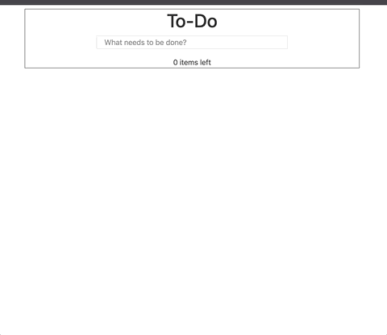

# To-Do App with React and Cloud 9

A to-do app that uses react, bootstrap, HTML, CSS, allows the user to be able to add items to the list, delete tasks, and has a counter to keep track of the pending tasks. 



## Live App: [https://scotth527.github.io/todolist/](https://scotth527.github.io/todolist/)

Built from the 4GeeksAcademy react-hello boilerplate here: [https://github.com/4GeeksAcademy/react-hello](https://github.com/4GeeksAcademy/react-hello)

### Run the Project from Cloud 9 IDE

##### Make sure you have node version 8
```sh
$ nvm install 8
$ nvm use 8
$ node -v
```

#### Then run the app!
```sh
$ npm run c9
```

##### Install the npm package when changes are made to package.json:
```sh
$ npm install
```

##### Re-build bundle for deployment outside of GitHub Pages

```sh
$ npm run build
```